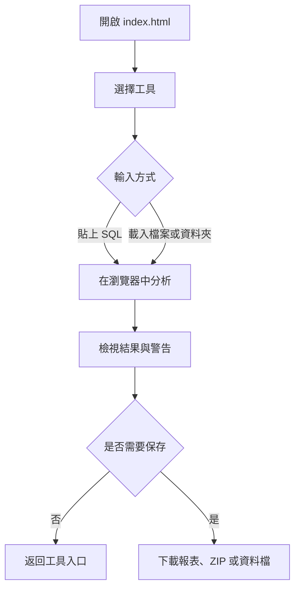
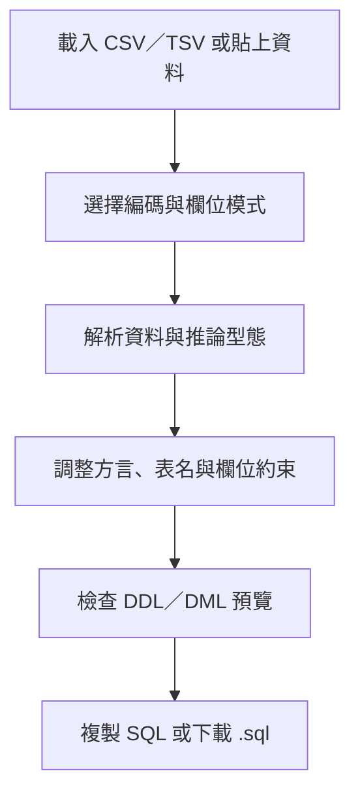
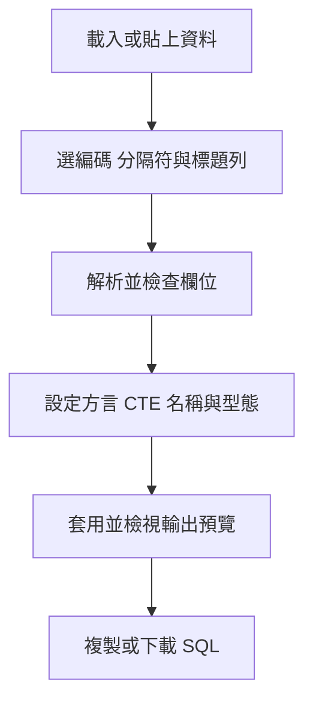
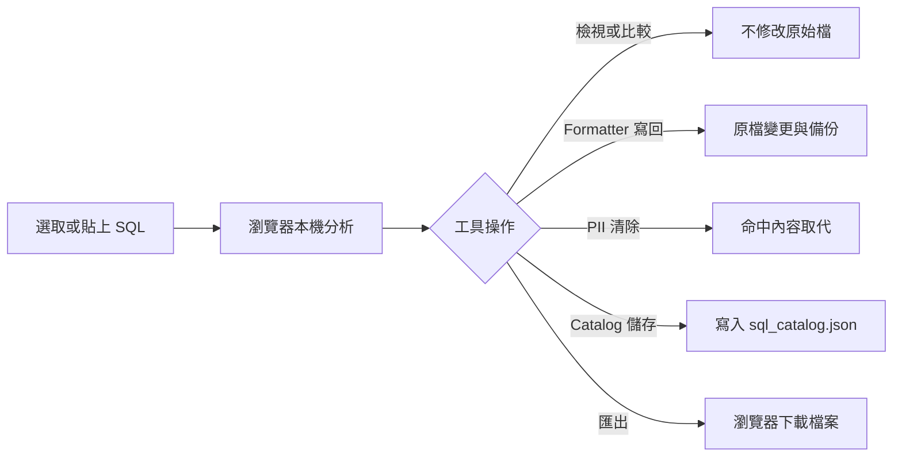

# SQL SPA Tools 使用手冊

SQL SPA Tools 是一組以瀏覽器執行的 Oracle SQL 工具集，包含格式化、差異比對、個資清除、SQL 清冊與欄位血緣分析。工具以純前端方式在本機執行，適合在不把 SQL 上傳到服務端的情況下進行檢查與整理。

## 目錄

- [快速開始](#快速開始)
- [整體使用流程](#整體使用流程)
- [共用介面](#共用介面)
- [工具選擇](#工具選擇)
- [Oracle SQL Formatter](#oracle-sql-formatter)
- [Oracle SQL Compare](#oracle-sql-compare)
- [SQL 個資清除器](#sql-個資清除器)
- [SQL Catalog](#sql-catalog)
- [SQL 欄位血緣分析器](#sql-欄位血緣分析器)
- [SQLScriptManage](#sqlscriptmanage)
- [Excel／CSV 轉 SQL](#excelcsv-轉-sql)
- [Excel／CSV 轉 SQL CTE](#excelcsv-轉-sql-cte)
- [資料安全與保存](#資料安全與保存)
- [常見問題排除](#常見問題排除)
- [維護者驗證](#維護者驗證)
- [CI 自動化測試](#ci-自動化測試)

## 快速開始

1. 將本資料夾完整保留，直接雙擊開啟 [index.html](index.html)。
2. 在「工具入口」選擇要使用的工具。
3. 依工具說明載入 SQL 文字、SQL 檔案或 SQL 資料夾。
4. 分析完成後，可在瀏覽器內檢視結果，或使用工具提供的匯出功能保存報表。

不需要安裝 Node.js、資料庫或額外套件。若瀏覽器限制本機檔案權限，可使用任意靜態檔案伺服器預覽本資料夾；這只影響檔案存取權限，不會改變工具的離線執行方式。



## 共用介面

### 回到工具入口

除入口頁外，每個工具頁右下角都有「⌂ 工具入口」連結。按下後會回到 `index.html`，不會清除目前頁面已載入的資料。

### 深淺色模式

- 預設為淺色模式；只有使用者明確選擇深色時才切換為深色。
- 右下角的「☀️ 淺色模式／🌙 深色模式」可切換顯示。
- 選擇會保存在目前瀏覽器的網站儲存空間；下次開啟時會沿用上次選擇。
- 若瀏覽器封鎖 `localStorage`，功能仍可使用，但主題不一定能跨次保存。

### 檔案權限提示

當工具需要直接讀取資料夾或寫回檔案時，瀏覽器會顯示權限視窗。請只授權給實際要處理的 SQL 根目錄；不需要時可改用唯讀模式或下載結果。

## 工具選擇

| 工具 | 適用情境 | 主要輸出或影響 |
| --- | --- | --- |
| Oracle SQL Formatter | 統一 SQL 排版、大小寫與格式 | 預覽、寫回、ZIP、HTML 報告 |
| Oracle SQL Compare | 比較舊版與新版 SQL | 差異檢視、Unified 文字、HTML 報表 |
| SQL 個資清除器 | 找出並清除 SQL/TXT 中的特定個資格式 | 寫回或清除後 ZIP、CSV 報告 |
| SQL Catalog | 建立 SQL 檔案清冊與維護用途、分類、標籤 | `sql_catalog.json`、CSV、Markdown、HTML、ZIP |
| SQL 欄位血緣分析器 | 分析欄位來源、上下游關係與 CTE | SVG、PNG、CSV、JSON、Mermaid |
| SQLScriptManage | 離線管理專案、SQL 腳本草稿與版本分支 | JSON 備份、SQL 檔案、版本歷程 |
| Excel／CSV 轉 SQL | 將 CSV、TSV 或貼上的試算表資料轉成 SQL | DDL、批次 INSERT、`.sql` |
| Excel／CSV 轉 SQL CTE | 將 CSV、TSV 或貼上的試算表資料轉成可查詢的 `WITH` CTE 虛擬資料表 | SQL 預覽、複製完整 SQL、`.sql` |

## Oracle SQL Formatter

1. 按「📁 選擇資料夾」，選取 SQL 根目錄並授予編輯權限。
2. 使用上方設定調整副檔名、編碼、縮排、識別字大小寫、PL/SQL 處理方式，以及關鍵字、函數和欄位排列規則。
3. 先按「🔄 重新掃描」確認檔案清單，再勾選要處理的檔案。
4. 按「👁 格式化預覽」檢查變更；也可在下方貼上 SQL，按「▶ 格式化＋健檢」快速測試目前設定。
5. 確認結果後選擇：
   - 「💾 寫回檔案」：寫入選取檔案。
   - 「↩ 還原本次」：還原本次寫回的變更。
   - 「📦 匯出 ZIP」：下載格式化後檔案，不直接改動原檔。
   - 「📄 匯出報告」：下載 HTML 格式的處理報告。

寫回前可保留 `_sqlfmt_backup` 備份。若瀏覽器不支援直接寫回，工具會切換成唯讀加 ZIP 匯出模式；請以 ZIP 內容取代或另存檔案。

## Oracle SQL Compare

1. 在左側「舊版 SQL」與右側「新版 SQL」貼上內容，或各自按「開啟檔案」載入檔案；也可以拖放檔案到編輯區。
2. 依需求設定忽略大小寫、空白、註解、空行，以及結尾 `;` 或 `/`。
3. 選擇「並排」或「整合」檢視，必要時開啟「僅顯示差異」和「自動換行」。
4. 按「▶ 比對」。結果可切換「逐行差異」與「結構差異摘要」。
5. 用「上一個／下一個」巡覽差異，或按「複製差異 (Unified)」、「複製結構摘要」。
6. 按「匯出 HTML 報表」下載可保存與分享的差異報表。

「交換」可互換兩側內容；「清除」會清空目前編輯內容；「範例」可載入內建 SQL 供快速試用。

## SQL 個資清除器

這個工具會掃描 SQL/TXT 檔案中的指定格式，例如身分證字號、居留證、存款帳號、統一編號與特定業務序號。它是破壞性操作，執行前請先確認備份與命中範圍。

1. 優先按「① 選擇資料夾（可寫回）」並選取要處理的根目錄；若瀏覽器不支援寫回，改用「選擇資料夾（唯讀相容模式）」。
2. 在規則區勾選要偵測的個資類型與檢查碼規則，設定排除資料夾，例如 `_backup_*,.git`。
3. 按「重新掃描」，檢查命中檔案與命中內容摘要。
4. 只勾選確認要處理的檔案，再按「② 整批取代為空字串」。
5. 視需要使用：
   - 「下載清除後檔案（ZIP）」：下載清除後內容，不依賴直接寫回。
   - 「匯出報告（CSV）」：保存掃描與處理結果。

啟用「取代前備份至 `_backup_時間` 資料夾」可在寫回前保留備份。唯讀模式不會修改原始目錄，應以 ZIP 作為後續交付檔案。

## SQL Catalog

SQL Catalog 會掃描根目錄中的 SQL 檔案，建立可搜尋、可分類的清冊。它不會修改 SQL 原始檔，但會寫入清冊檔案。

1. 按「📁 選擇目錄」，選取 SQL 根目錄並允許「編輯檔案」。
2. 等待掃描完成；若已使用過此工具，可按「▶ 繼續上次目錄」或「↩ 恢復上次目錄」。
3. 使用搜尋框、快速篩選或分類、標籤、引用表格、語法類型、掃描狀態、生命週期與待辦狀態篩選資料。
4. 點選檔案後，在右側編輯用途、分類、標籤、執行頻率、生命週期、待辦與備註；可用「批次編輯」處理多筆紀錄。
5. 按「💾 儲存」保存清冊；工具會在根目錄維護 `sql_catalog.json`，第一次寫入前會將既有檔案備份為 `sql_catalog.bak.json`。
6. 從「⬇️ 匯出」選擇：CSV 全部、CSV 目前篩選結果、Markdown 清冊、HTML 報表、下載 `sql_catalog.json`，或「匯入 JSON（合併）」。
7. 「📦 打包下載」可依勾選、目前篩選結果或全部檔案產生 ZIP，也可選擇保留資料夾結構與附加清冊 CSV。

若瀏覽器不支援 File System Access API，Catalog 會以唯讀模式運作；說明會保存在瀏覽器快取，請定期使用「匯出 → 下載 sql_catalog.json」手動保存。

## SQL 欄位血緣分析器

1. 使用「載入檔案」選取一或多個 `.sql`、`.txt`、`.ddl` 檔案，或用「載入資料夾」批次載入；也可按「貼上 SQL」。
2. 在編輯區確認內容，按「分析（Ctrl+Enter）」；「內建範例」可快速檢查介面。
3. 依需要查看：
   - 「血緣圖」：以圖形查看來源、目標與欄位關係。
   - 「欄位對照表」：篩選端到端或逐層關係、目標範圍與直接／間接關係。
   - 「上下游追溯樹」：輸入欄位或 `物件.欄位`，選擇上游、下游或雙向追溯。
   - 「CTE 大綱」：檢視 CTE、物件、欄位數與上下游物件。
   - 「語句與訊息」：查看解析訊息，必要時只顯示警告／錯誤。
4. 在圖表中可調整顯示層級、聚焦欄位、適合視窗與縮放。
5. 使用匯出功能下載 SVG、PNG、CSV、JSON 或 Mermaid；分析結果會以瀏覽器下載檔案保存。
6. 「全部清除」會清除目前載入的檔案、SQL 與分析結果；需要保留時請先匯出。

## SQLScriptManage

SQLScriptManage 是單一 HTML 的離線 SQL 專案與版本管理工具，資料預設保存在目前瀏覽器的 IndexedDB，不會上傳到網路。

1. 從工具入口開啟 SQLScriptManage；首次使用會建立「我的 SQL 專案」。
2. 以「＋專案」建立專案，再用「＋新增 SQL 腳本」建立腳本，或直接匯入 `.sql` 檔案。
3. 編輯器內容會自動保存為草稿；完成後按「儲存新版本」，填寫版本名稱與變更備註。
4. 在右側版本歷程點選任一節點即可載入歷史內容；從舊版本繼續提交會建立分支。
5. 使用「匯出備份」保存完整 JSON；匯入時可選擇合併或覆蓋全部資料。
6. 當腳本已有兩個以上版本時，按右側「版本比對」，可任選基準／目標版本，切換左右並排、Unified Diff 或差異摘要，也可下載 HTML 差異報表。

版本比對預設逐行比較，並支援忽略大小寫、行尾空白與空白行；比較只讀取版本內容，不會修改草稿或版本歷程。

若瀏覽器不允許 IndexedDB，頁面會切換成記憶體模式並顯示警告；此模式關閉分頁後資料會消失，請先完成 JSON 備份。

## Excel／CSV 轉 SQL

此工具可在瀏覽器中將 CSV、TSV、TXT 或直接貼上的 Excel／Google Sheets 資料轉成 PostgreSQL、MySQL／MariaDB、Microsoft SQL Server、Oracle 或 SQLite 語法。原始資料不會上傳到網路。

1. 開啟「Excel／CSV 轉 SQL」，將檔案拖放到輸入區，或直接貼上以 Tab 或逗號分隔的資料；載入檔案時可選擇自動偵測 BOM、UTF-8、Big5／CP950、UTF-16 LE 或 UTF-16 BE 編碼。
2. 按「解析資料」。若首列看起來不像欄位標題，工具會提示並改用自動欄位名稱；也可以手動選擇「首行作為欄位名稱」或「自動產生欄位名稱」。
3. 選擇 SQL 方言、資料表名稱與每批筆數，依需求開啟 `CREATE TABLE`、`DROP TABLE`、`IF NOT EXISTS` 與交易包裝。
4. 檢查欄位推論結果，可覆寫欄位型態、設定 PK 或取消 `NOT NULL`。若資料沒有標題，可勾選「啟用自訂欄位名稱」，輸入以逗號或 Tab 分隔的名稱後按「套用自訂欄位名稱」。
5. 在「DDL（Schema）」與「DML（Insert）」分頁檢查輸出；確認無誤後按「複製目前 SQL」或「下載 .sql」。

工具會辨識常見的整數、小數、日期、時間、布林值與文字；空字串、`NULL`、`N/A`、`nil` 與 `-` 等值會依輸出規則處理為 SQL `NULL`。前導零資料若不適合當數字，請在欄位設定中覆寫為文字型態。



## Excel／CSV 轉 SQL CTE

此工具會把試算表資料整理成 `WITH` CTE 查詢，適合建立臨時測試資料或將小型資料集直接帶入查詢。支援 PostgreSQL、Microsoft SQL Server、MySQL 8.0.19+、Oracle 12c+、SQLite、DuckDB、Snowflake 與 BigQuery。

1. 拖放或選擇 CSV／TSV／TXT 檔案，也可直接貼上 Excel 試算表資料；檔案超過 200 MB 時需先拆分。
2. 選擇檔案編碼與欄位分隔符，並確認首列是否為欄位標題。支援自動偵測、UTF-8、Big5／CP950、Big5-HKSCS、UTF-16LE 與 UTF-16BE。
3. 按「解析資料」，檢查欄位名稱與推論型態；需要時啟用自訂欄位名稱，並逐欄覆寫資料型態。
4. 選擇資料庫方言、CTE 名稱及每個分塊列數；部分方言也可選擇「單一大型 VALUES」。調整完成後按「套用設定」。
5. 檢查 CTE SQL 預覽與資料列、欄位、分塊統計，再按「複製完整 SQL」或「下載 .sql」。預覽過長時會省略中段，複製與下載仍會輸出完整 SQL。

空值、空字串、`NULL`、`N/A`、`NA` 與 `nil` 會依欄位型態輸出為 SQL `NULL`。若數字欄位含有前導零識別碼，請將欄位型態覆寫為文字，避免依數字解讀。



## 資料安全與保存

- 工具是純前端離線頁面；SQL 內容與分析主要在目前瀏覽器分頁中處理，不會由本專案主動上傳到伺服器。
- 只有在你明確選擇資料夾並授予權限時，Formatter、PII Cleaner 與 Catalog 才會嘗試存取或寫入本機檔案。
- Formatter 可寫回選取檔案；PII Cleaner 可能以空字串取代命中內容；執行前請保留備份或先使用 ZIP 方式確認結果。
- Catalog 的主要持久資料是選取根目錄中的 `sql_catalog.json`；瀏覽器快取只適合作為暫存備援，不應取代正式備份。
- 主題與部分工具設定會存於瀏覽器的 `localStorage`，不等同於 SQL 檔案備份，也不會跨瀏覽器同步。
- 下載的 ZIP、CSV、HTML、JSON、SVG、PNG 與 Mermaid 檔案會交由瀏覽器的下載位置管理。



## 常見問題排除

### 雙擊後頁面空白或樣式不完整

確認 `index.html`、`theme.css`、`theme.js` 與各工具 HTML 位於同一資料夾，且沒有只複製單一 HTML 檔。重新整理頁面後再試。

### 無法選擇或寫回資料夾

請使用較新的 Chrome 或 Edge，重新開啟工具並授予該資料夾權限。若仍無法寫回，使用唯讀相容模式或下載 ZIP；不要把瀏覽器錯誤當成已成功修改檔案。

### Catalog 顯示唯讀或找不到上次目錄

這通常是瀏覽器尚未恢復目錄權限。按「恢復上次目錄」並重新允許存取；若仍失敗，重新按「選擇目錄」。寫入失敗時，立即匯出 `sql_catalog.json` 保存目前清冊。

### 找不到預期的個資命中

檢查對應規則是否勾選、是否啟用檢查碼，以及排除資料夾設定是否過度寬泛。先用小範圍檔案測試，再處理整個根目錄。

### 血緣圖沒有結果或結果不完整

確認 SQL 已載入且已按「分析」；查看「語句與訊息」中的警告。複雜語法、解析器不支援的語句或缺少來源欄位時，請同時參考欄位對照表與 CTE 大綱。

### 主題切換後下次沒有記住

確認瀏覽器允許網站儲存資料。清除網站資料、使用無痕視窗或瀏覽器政策限制，都可能移除主題與工具設定。

## 維護者驗證

以下命令用於確認共用主題、入口頁與回首頁契約；一般使用者不需要執行。

```powershell
node '.\tests\test-theme.js'
node '.\tests\test-excel-csv-sql.js'
node '.\tests\test-excel-csv-sql-cte.js'
node '.\tests\test-sqlscriptmanage.js'
& '.\tests\validate-theme.ps1'
& '.\tests\validate-index.ps1'
& '.\tests\validate-home-links.ps1'
```

Excel／CSV 轉 SQL 的人工驗收資料位於 [uat-fixtures](uat-fixtures/)，涵蓋 UTF-8、Big5／CP950、UTF-16、無標題 TSV、引號、逗號、多行儲存格與前導零等情境。可依 [uat-fixtures/README.md](uat-fixtures/README.md) 的建議設定逐項確認預覽、複製與下載結果。

Windows PowerShell 讀取本文件時，請明確指定 UTF-8：

```powershell
[Console]::OutputEncoding=[System.Text.Encoding]::UTF8
[System.IO.File]::ReadAllText((Resolve-Path 'README.md'), [System.Text.Encoding]::UTF8)
```

設計規範與命名規範請參閱 [docs/THEME.md](docs/THEME.md) 與 [docs/NAMING.md](docs/NAMING.md)；所有網頁設計、主題引用與入口導覽都應遵循這兩份文件。

## CI 自動化測試

本專案在 GitHub 上以 Actions 自動執行回歸測試，設定檔為 [.github/workflows/regression-test.yml](.github/workflows/regression-test.yml)。

### 觸發條件

- `push`：任何分支的每次推送。
- `pull_request`：建立或更新提取請求時。
- `workflow_dispatch`：可在 GitHub 手動觸發。

同一分支若同時有開啟中的提取請求，`push` 與 `pull_request` 會各執行一次，屬正常行為。

### 執行內容

| 工作項目 | 執行環境 | 內容 |
| --- | --- | --- |
| Node 22 JavaScript 測試 | `ubuntu-latest` | `test-theme.js`、`test-excel-csv-sql.js`、`test-excel-csv-sql-cte.js`、`test-sqlscriptmanage.js`，以及 `node --check theme.js` |
| Windows PowerShell 驗證 | `windows-latest` | `validate-theme.ps1`、`validate-index.ps1`、`validate-home-links.ps1` |

兩個工作會平行執行；每支測試各自一個步驟，失敗時可直接看出是哪一項。workflow 僅要求 `permissions: contents: read`，不會寫入倉儲，也不需要安裝任何 npm 套件。

### 查看與手動執行

1. 開啟 GitHub 專案頁面，切換到「Actions」分頁。
2. 左側選擇「回歸測試」，再點選任一次執行。
3. 展開各工作的步驟即可查看完整日誌；❌ 表示該步驟失敗。
4. 手動執行：進入「回歸測試」頁面，按右側「Run workflow」，選擇分支後啟動。

CI 失敗時，先在本機執行「維護者驗證」中的對應命令重現，排除環境差異後再修正。
